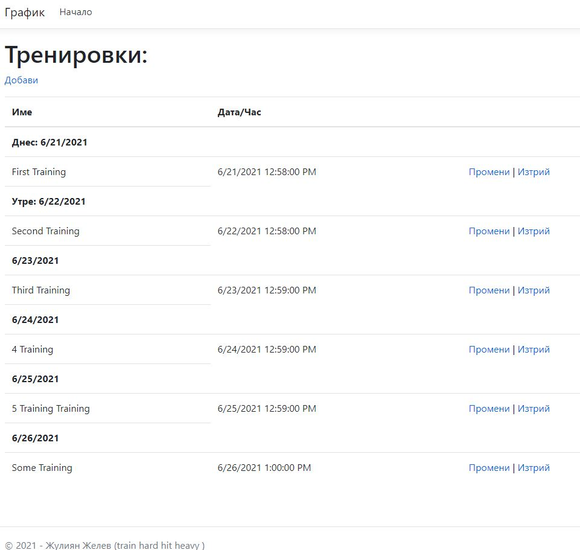
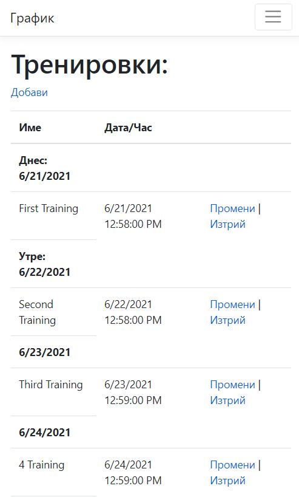
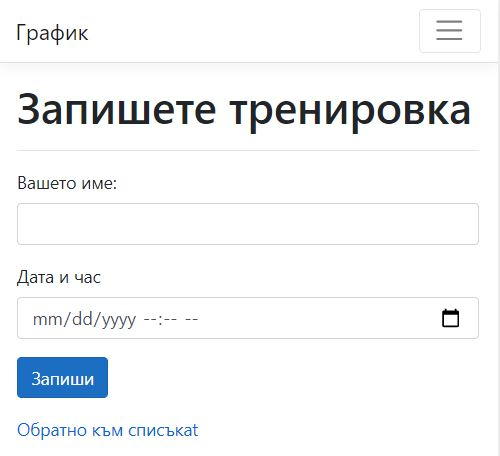

# Scheduler

Ready to use, .NET MVC based, weekly scheduler for trainings.

## Application Introduction

Scheduler will be responsible for managing personal trainings (when and who will be on the training )

## System Requirements
- Web-based application
- Performs CRUD operations on the trainings
- Manages vacation days

## Continuous Integration Tools
- GitHub Pipelines

- Travis CI 

## Screens

- Home

- Home on mobile

- Create

